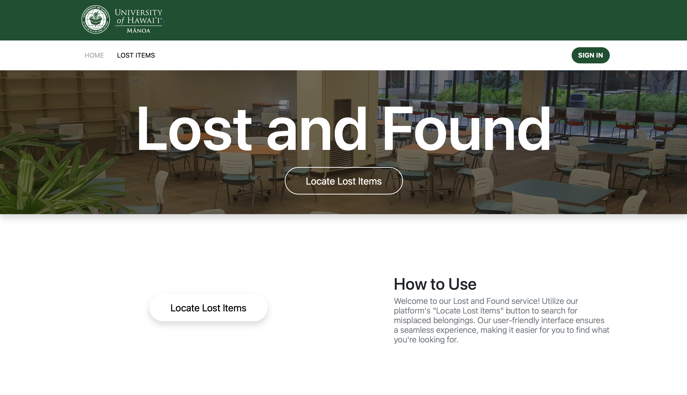
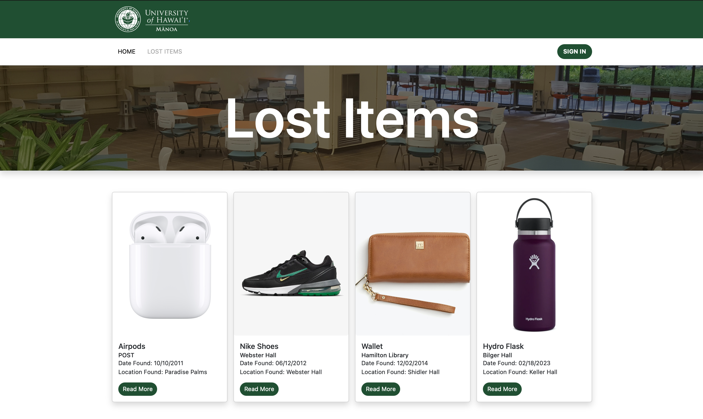

  

## UHM Lost and Found
Final Project

As a group final project our team developed an application to help students and UH community members  locate their lost items on campus. Departments can access the site to post lost items with the intention of the owner being able to reclaim their property from a known location on campus.

  

From brainstorming to the development process, our team pushed our abilities to design a cooperative program together that could merge without conflict. I learned a lot during the course of the semester, however I feel like I didn’t really learn it until this final project. The contributions I made which are building the LostItems collection and Lost Items page strengthened what I understand about Meteor, and using a MongoDB database. Fitting those components into a program built by a team brought upon other learning points from tasks in having to design cohesively.

[UHM GitHub](https://github.com/uhm-lost-and-found/uhm-lost-and-found)
